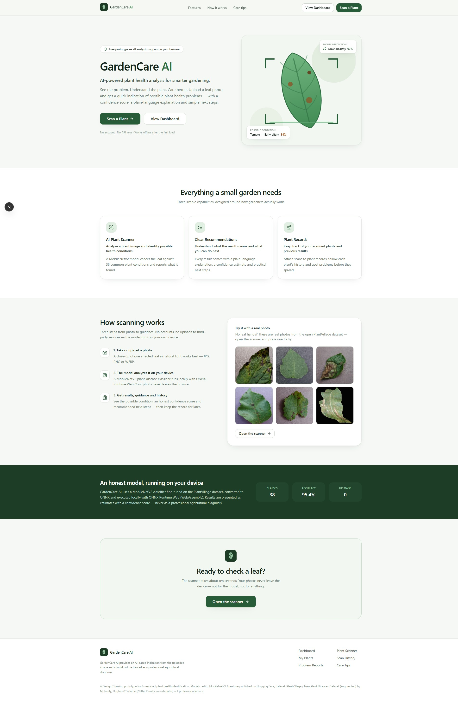
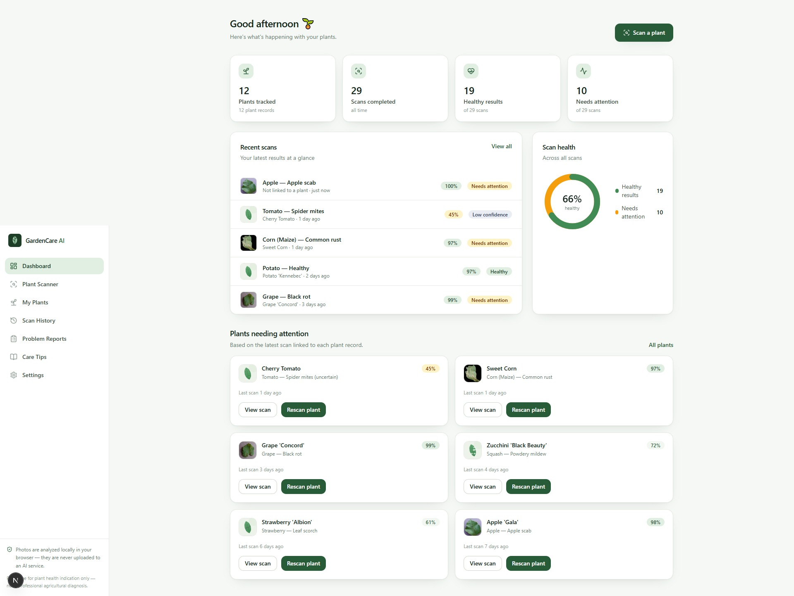
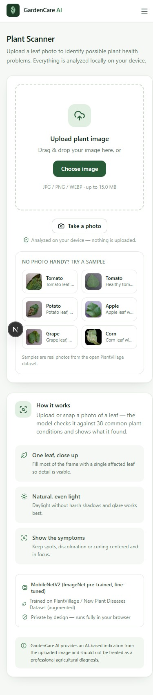

# GardenCare AI

**See the problem. Understand the plant. Care better.**

GardenCare AI is a working software prototype that identifies possible plant health problems from a leaf photo. Upload an image, run a real image-classification model **entirely in your browser**, and get an honest result: the possible condition, an estimated confidence, a plain-language explanation and simple recommended next steps.

> **GardenCare AI provides an AI-based indication from the uploaded image and should not be treated as a professional agricultural diagnosis.**





<p align="center"></p>

---

## Table of contents

- [Problem statement](#problem-statement)
- [Solution](#solution)
- [Features](#features)
- [Technology stack](#technology-stack)
- [AI model and dataset](#ai-model-and-dataset)
- [Licenses](#licenses)
- [How the AI inference works](#how-the-ai-inference-works)
- [Cloud backup (Supabase)](#cloud-backup-supabase)
- [What it can and can't identify](#what-it-can-and-cant-identify)
- [Model setup / download](#model-setup--download)
- [Run locally](#run-locally)
- [Build](#build)
- [Deploy](#deploy)
- [Project structure](#project-structure)
- [Testing](#testing)
- [Limitations](#limitations)
- [Future improvements](#future-improvements)

---

## Problem statement

Home gardeners and students often struggle to identify plant problems such as diseases, pest damage and poor plant health, and to recognise them quickly enough to act. Symptoms are easy to confuse, and waiting for an expert opinion is slow — by the time a problem is obvious, it has often spread.

*(This prototype grew out of a Design Thinking exercise: the identified user need was fast, understandable plant-health indication with simple follow-up guidance.)*

## Solution

A polished, mobile-friendly web app where a gardener:

1. uploads (or photographs) a leaf image,
2. runs a **real, free, open-source image-classification model locally in the browser** — no paid AI API, no API keys, no uploads to third-party services,
3. receives a possible condition, an estimated confidence, an honest low-confidence state when the model is unsure, and practical next steps,
4. can keep plant records, scan history and simple problem reports so nothing gets forgotten.

This is the **software-only** part of the solution. It deliberately contains **no hardware/IoT components** (no ESP32, sensors, pumps or automatic irrigation).

## Features

| Area | What it does |
| --- | --- |
| **Plant health scanner** | Drag & drop / camera upload, preview, "Analyze Plant", real in-browser inference, result card with condition, confidence, explanation and next steps |
| **Honest results** | "Possible condition" / "Model prediction" / "Estimated confidence" wording, a persistent disclaimer, and a clear low-confidence state ("Unable to confidently identify the condition… try a clearer image") governed by a user-adjustable threshold |
| **Cloud backup** | Plants, scans and reports are also saved to a Supabase database from the app's own server route — history can be restored after clearing local data. RLS is enabled and no key ever reaches the browser |
| **Dashboard** | Greeting, plants tracked / scans / healthy / needs-attention stats, recent scans, scan-health donut, "Plants needing attention" cards |
| **My Plants** | Plant records (name, species, location, notes, date added), search, status from the latest linked scan, scan/history shortcuts |
| **Scan history** | Every scan with thumbnail, prediction, confidence, date and status; filters (healthy / needs attention / low confidence / by plant) kept in the URL; full scan detail page with re-scan and delete |
| **Problem reports** | Manual reports (plant disease / pest / waste / damaged plant / other) with preset or custom location, description, optional photo and status workflow (Reported → Under review → Resolved) |
| **Care tips** | Static, hand-written guidance: watering, sunlight, pest prevention, disease prevention, leaf inspection, garden cleanliness |
| **Settings** | Display name, confidence threshold, export JSON, restore demo data, clear all data, model/dataset/license info |
| **Demo data** | Realistic, clearly marked demo dataset (12 plants, 28 scans, 6 reports) so the app looks complete on first launch |
| **Accessibility** | Semantic HTML, skip link, keyboard navigation, focus trapping in dialogs, labelled inputs, `aria-live` announcements, sufficient contrast, visible focus states |

## Technology stack

- **Next.js 16** (App Router, Turbopack) · **React 19** · **TypeScript**
- **Tailwind CSS v4** — custom botanical theme (moss palette, soft shadows, rounded cards)
- **lucide-react** — icons
- **onnxruntime-web** (WebAssembly) — on-device inference
- **localStorage** behind a small repository interface (`DataRepository`) — the local-first source of truth
- **Supabase (Postgres)** — optional cloud backup for user records, accessed only through a server route (see below)
- No chart library, no UI framework — a hand-built design system for a small dependency surface

## AI model and dataset

**Model (inference):** [`onnx-community/mobilenet_v2_1.0_224-plant-disease-identification-ONNX`](https://huggingface.co/onnx-community/mobilenet_v2_1.0_224-plant-disease-identification-ONNX) — an ONNX conversion of the fine-tuned [linkanjarad/mobilenet_v2_1.0_224-plant-disease-identification](https://huggingface.co/linkanjarad/mobilenet_v2_1.0_224-plant-disease-identification) checkpoint.

- Architecture: **MobileNetV2** (ImageNet-pretrained, fine-tuned for 38-class plant/disease classification)
- Input: **224 × 224 px** RGB, mean/std = 0.5 → tensor scaled to [-1, 1]
- Output: **38 logits** → softmax in the app
- Reported accuracy: **95.4% top-1** on the held-out evaluation set of the dataset below (model card metric)

**Dataset:** [PlantVillage](https://github.com/spMohanty/PlantVillage-Dataset) — 54,306 images, 14 crop species and 26 diseases across **38 healthy/diseased classes** (Mohanty, Hughes & Salathé, 2016). The fine-tune used the Kaggle "New Plant Diseases Dataset" (augmented PlantVillage).

**Why this combination?** It is the most practical fully-free option: a small, well-performing, browser-friendly CNN with published weights and an existing ONNX build — no training required, no paid inference API, and it runs entirely on the user's device.

**Build choice — fp32 over quantized (verified, not assumed):** the repository also ships int8/quantized builds, but those **collapsed to near-random predictions** for this architecture when tested (`scripts/validate_model.py` classifies 6 real PlantVillage photos; the int8 build got 0/6 while the **fp32 build (~9 MB) got 6/6** with 84–100% confidence). The app therefore ships the fp32 build and loads it once with a real download-progress bar; the browser caches it afterwards.

## Licenses

> This is a prototype; review licences before any non-research use.

- **Dataset:** PlantVillage is an open-access research dataset (Mohanty, Hughes & Salathé, 2016, Frontiers in Plant Science, DOI [10.3389/fpls.2016.01419](https://doi.org/10.3389/fpls.2016.01419)). The Kaggle-hosted augmented version is published for research use (CC BY-SA 3.0). Six sample images from the dataset repository are bundled for demos and tests under the same terms.
- **Model:** the base architecture [google/mobilenet_v2_1.0_224](https://huggingface.co/google/mobilenet_v2_1.0_224) is Apache-2.0. The fine-tuned checkpoint and its ONNX conversion are published on Hugging Face under the model card's **"other"** license declaration (derived from the research dataset) — suitable for this open, non-commercial prototype. For commercial use, fine-tune on a suitably licensed dataset and review terms.
- **Runtime:** onnxruntime-web and Next.js are MIT-licensed.

## How the AI inference works

Everything runs client-side — the leaf photo **never leaves the browser**.

1. **Preprocess** (`src/lib/inference/preprocess.ts`): decode the uploaded file (EXIF-aware), resize so the shortest edge is 256 px, center-crop to 224 × 224, rescale to [0, 1], normalize with mean = std = 0.5, and lay out a `1 × 3 × 224 × 224` float32 CHW tensor. This exactly mirrors the model's published feature extractor and is verified against a Python reference (`scripts/validate_model.py`) — browser and Python results match (e.g. tomato early-blight ≈ 84% in both).
2. **Load the model** (`src/lib/inference/classifier.ts`): `onnxruntime-web` (wasm-only build) is imported lazily; the single WASM runtime is served same-origin from `/public/ort`; the ~9 MB ONNX weights are fetched from `/public/models/plant-disease/onnx/model.onnx` with real byte-level progress on first use, then cached by the browser.
3. **Infer**: a single `session.run()` call executes MobileNetV2 (typically tens of milliseconds), and softmax produces class probabilities. The top-3 are returned with timing.
4. **Interpret** (`src/lib/inference/classes.ts`): the 38 class ids map to structured metadata — plant, condition, healthy/unhealthy, a short explanation and hand-written care guidance.
5. **Honesty layer**: the result is labelled "Model prediction" / "Possible condition" / "Estimated confidence"; results below the user's threshold (default 60%) switch to a low-confidence state instead of a confident claim; the disclaimer is always shown.

## Cloud backup (Supabase)

History is local-first, but every user action is also backed up to a **Supabase Postgres** database, so records survive clearing browser data on the same browser.

**The browser never talks to Supabase.** All access goes through one small server route (`src/app/api/cloud/route.ts`) that holds the server-only secret key:

- Env vars (server-only, **no** `NEXT_PUBLIC_` prefix): `SUPABASE_URL`, `SUPABASE_SECRET_KEY` — see `.env.example`. They are never bundled into the frontend.
- Tables: `plants`, `scans`, `problem_reports` (see `supabase/schema.sql`). Every row carries an anonymous `device_id`.
- **RLS is enabled on all tables with no public policies** and the `anon` / `authenticated` roles are explicitly revoked: the publishable/anon keys can read or write **nothing** (verified — the REST API returns `401`). Only the server route (secret key) can touch the data.
- Writes are fire-and-forget: if Supabase is unreachable or not configured, the app simply behaves as before (local-only). Nothing breaks.
- **Restore**: when the app opens in a browser with no local data — or via *Settings → Restore from cloud* — any rows stored for that browser's anonymous key are merged back in.
- Demo data is never uploaded; only records you actually create are backed up.

Honest limits: without sign-in, the "account" is an anonymous random key kept in a 1-year cookie. Restoring works on the same browser; cross-device sync arrives with real accounts later. If a full site-data wipe removes both storage and the cookie, a new anonymous key is issued and older cloud rows can no longer be reached.

## What it can and can't identify

**It is a crop-disease detector, not a plant identifier.** The model has exactly 38 classes across 14 crops (apple, blueberry, cherry, corn, grape, orange, peach, bell pepper, potato, raspberry, soybean, squash, strawberry, tomato).

- For those crops it reports the plant + the condition (or "Healthy") with an honest confidence score, an explanation and next steps.
- For anything else — garden weeds (parthenium, nutgrass…), rice, chilli, okra, brinjal, basil, roses or unknown plants — it **cannot tell you what the plant is**. It will still pick one of its 38 known answers: often with low confidence (the app then shows the low-confidence warning), but sometimes confidently wrong.
- Practical rule: trust high-confidence results only for the supported crops; treat everything else as out of scope. An "unknown / out of scope" check and India-specific datasets are listed under [Future improvements](#future-improvements).

## Model setup / download

The model and runtime assets are **committed to this repository**, so a fresh clone runs without setup. If you ever need to re-fetch them (or want to verify provenance):

```bash
npm install          # installs onnxruntime-web (needed by the copy step)
npm run setup        # downloads the ONNX model + config into public/models/...,
                     # downloads the 6 sample photos into public/samples/,
                     # and copies the ORT wasm runtime into public/ort/
```

Model page: <https://huggingface.co/onnx-community/mobilenet_v2_1.0_224-plant-disease-identification-ONNX>

Optional Python sanity check (loads the model + samples and prints top-3 predictions):

```bash
pip install onnxruntime pillow numpy
python scripts/validate_model.py
```

Expected output on the bundled samples: Apple Scab 99.8% · Corn Common Rust 99.9% · Grape Black Rot 99.2% · Potato Late Blight 66.8% · Tomato Early Blight 83.9% · Healthy Tomato 100%.

## Run locally

Requirements: **Node.js ≥ 20** and npm.

```bash
git clone <this repository>
cd gardencare-ai
npm install
npm run dev
```

Open <http://localhost:3000>. The first analysis downloads the ~9 MB model (with a progress bar); afterwards it loads from cache. Everything works offline after that first load.

Cloud backup is optional in development: copy `.env.example` to `.env.local` and fill in your Supabase values (server-only keys — see [Cloud backup](#cloud-backup-supabase)). Without them the app runs local-only and nothing breaks.

## Build

```bash
npm run build   # production build (all routes prerender; /history/[id] is dynamic)
npm start       # serve the production build at http://localhost:3000
npm run lint    # ESLint (clean)
```

## Deploy

The app is a pure client-side inference app — **no server functions, no environment variables, no API keys**. Any static-capable host works; it is deployed on **Vercel** (zero configuration — the repo builds as-is). To deploy your own copy:

1. Push the repository to GitHub.
2. Import it at <https://vercel.com/new> (framework auto-detected: Next.js).
3. Add environment variables (Project → Settings → Environment Variables): `SUPABASE_URL` and `SUPABASE_SECRET_KEY` for Production and Preview. No `NEXT_PUBLIC_` variables are needed — nothing about Supabase ships to the browser.
4. Deploy. The bundled model under `public/` is served with immutable cache headers (see `next.config.ts`).

Because inference is client-side, there is nothing to configure in production — if the static assets load, the scanner works.

## Project structure

```
scripts/                     # setup + validation tooling
  download-model.mjs         # fetch the ONNX model (fp32) + configs into public/
  download-samples.mjs       # fetch real PlantVillage sample photos
  copy-ort-assets.mjs        # copy the ORT wasm runtime into public/ort
  validate_model.py          # Python reference check of the model + samples
supabase/
  schema.sql                 # tables + RLS policy setup (run once per project)
.env.example                 # environment variable names for the cloud backup (no values)
public/
  models/plant-disease/      # config.json, preprocessor_config.json, onnx/model.onnx
  ort/                       # onnxruntime-web wasm runtime (same-origin)
  samples/                   # 6 real PlantVillage photos (demos + tests)
src/
  app/                       # routes: / (landing), /dashboard, /scanner, /plants,
                             # /history, /history/[id], /reports, /tips, /settings
    api/cloud/               # server route — the only place that talks to Supabase
  components/
    ui/                      # Button, Card, Badge, Field, Modal, EmptyState, …
    layout/                  # AppShell (sidebar + mobile drawer), PageHeader
    scanner/                 # PlantImageUploader, AnalysisProgress, ScanResultCard, ConfidenceBadge
    dashboard/               # DashboardStats, HealthDonut, RecentScans, AttentionList
    plants/                  # PlantCard, PlantFormDialog
    reports/                 # ProblemReportForm, ReportList
    history/                 # ScanStatusBadge
  lib/
    inference/               # preprocess, classifier (ORT), classes (38-class metadata)
    data/                    # types-backed repository, DataContext (store), seed data
    cloud/                   # Supabase backup client + row mappers (browser side)
    content/                 # hand-written care tips
    constants.ts, utils.ts
```

## Testing

- **Python reference check** — `python scripts/validate_model.py` verifies the model and the exact preprocessing against 6 real photos (all 6 correct).
- **Browser end-to-end** — the app was exercised with Playwright (automated MCP session) covering: landing load, navigation, upload (file chooser + bundled samples), invalid-file handling, model download, analysis, result card + confidence, saving scans (with plant linking), dashboard updates, plant creation, scan history + filters + detail, problem reports (submit, status flow, delete), demo-data restore, mobile layout (390 px, including the nav drawer) at every route, console cleanliness, 404 handling and overflow checks.
- **Cloud layer** — verified end-to-end against the real database: scan save, plant create, scan delete and wipe are all reflected in Postgres; clearing local data and reloading restored the backed-up scan; the publishable/anon key is rejected (`401`) while the server route works.

## Limitations

- **Not a diagnosis.** The model identifies visual patterns; it cannot see pests on the underside, root problems, nutrient issues or environmental stress. Always confirm with local expertise when a problem persists.
- **Dataset bias.** PlantVillage photos are largely **single leaves photographed on controlled, uniform backgrounds**. The model can be less accurate on busy real-world photos (multiple leaves, soil, hands, shadows). This is a known weakness of PlantVillage-trained models and is exactly why the app reports a confidence score and a low-confidence state.
- **Coverage.** The 38 classes cover 14 crop species; ornamental garden plants (roses, basil, etc.) are outside the model's scope — the app says so instead of guessing.
- **Storage.** Records live in `localStorage` (~5 MB) as the local-first source of truth: the app downscales photos and, near the limit, progressively retires the oldest full-size previews to their thumbnails. Export JSON exists for backup, and user records are also mirrored to Supabase.
- **Cloud backup is device-bound.** Without sign-in, records are linked to an anonymous key in this browser's cookie; restoring works on the same browser. A full site-data wipe (including cookies) issues a new key — cross-device sync comes with accounts later.
- **Demo data.** Seeded records are illustrative and clearly marked (`isDemo`), including the generated leaf illustrations used for their thumbnails.

## Future improvements

- IndexedDB (or a small free database) behind the existing `DataRepository` interface for larger histories and multi-device sync
- Optional account/sync layer; shared "garden" spaces for community gardens
- More training data with natural backgrounds, plus per-plant fine-tuned models to raise real-world accuracy
- On-device WebGPU execution and a smaller distilled model to cut the first-load payload
- Symptom timeline views (progression of a plant's condition across scans)
- Multi-leaf / whole-plant analysis and pest-specific detection
- Photo capture guidance overlay (align the leaf, check lighting) before the scan

---

*A Design Thinking prototype for plant health identification. Built with free and open-source components only: no paid AI APIs, no API keys, no data leaving the device.*
